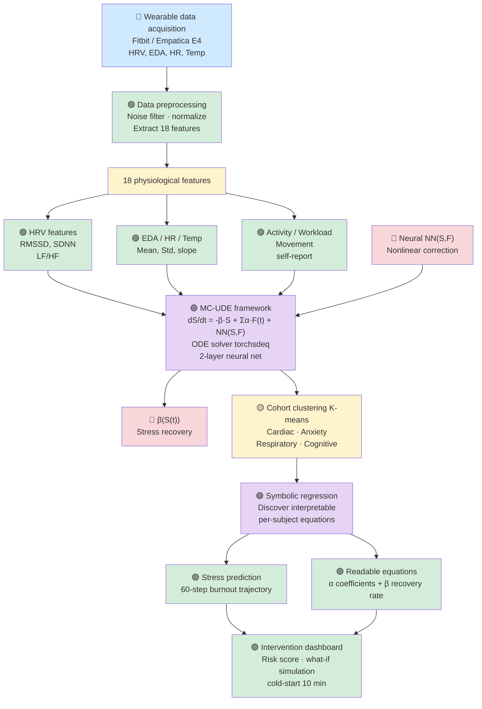

# Wearable Stress Recovery Analysis Pipeline

A comprehensive machine learning pipeline for analyzing physiological stress and recovery using wearable device data (Fitbit/Empatica E4).

## 📊 Pipeline Architecture



## 🔄 Pipeline Stages

### 1. **Data Acquisition**
- **Input**: Wearable sensors (Fitbit / Empatica E4)
- **Signals**: Heart Rate Variability (HRV), Electrodermal Activity (EDA), Heart Rate (HR), Temperature

### 2. **Data Preprocessing**
- Noise filtering
- Normalization
- Feature extraction → **18 physiological features**

### 3. **Feature Extraction** (3 Categories)

| Category | Features |
|----------|----------|
| **HRV Features** | RMSSD, SDNN, LF/HF ratio |
| **EDA / HR / Temp** | Mean, Standard Deviation, Slope |
| **Activity / Workload** | Movement metrics, Self-reported workload |

### 4. **Stress Dynamics Modeling (MC-UDE)**
- **Framework**: Neural ODE with Physics-Informed Learning
- **Model**: 
  ```
  dS/dt = -β·S + Σα·F(t) + NN(S,F)
  ```
- **Components**:
  - **β(S(t))**: Stress recovery rate (nonlinear)
  - **α coefficients**: Feature sensitivity weights
  - **NN(S,F)**: Neural network correction term
- **Solver**: torchsdeq ODE solver + 2-layer neural network

### 5. **Cohort Clustering**
- Algorithm: K-means clustering
- Dimensions:
  - Cardiac stress patterns
  - Anxiety indicators
  - Respiratory responses
  - Cognitive load markers

### 6. **Symbolic Regression**
- Discovers **interpretable per-subject equations**
- Converts complex dynamics into human-readable mathematical expressions

### 7. **Prediction & Interpretation**
- **Stress Prediction**: 60-step burnout trajectory forecasting
- **Readable Equations**: α coefficients + β recovery rate parameters

### 8. **Intervention Dashboard**
- Risk scoring
- What-if simulation capabilities
- Cold-start capability (10 minutes of data)

---

## 🛠️ Technical Stack

| Component | Technology |
|-----------|-----------|
| **Data Source** | Fitbit / Empatica E4 wearables |
| **Preprocessing** | Signal filtering, normalization |
| **Feature Extraction** | HRV, EDA, HR, Temp analysis |
| **ODE Solver** | torchsdeq |
| **Neural Network** | 2-layer MLP |
| **Clustering** | K-means |
| **Symbolic Regression** | Physics-informed discovery |

---

## 📈 Key Features

✅ **Physics-Informed Learning**: Combines domain knowledge with neural networks  
✅ **Interpretability**: Symbolic regression for human-readable equations  
✅ **Personalization**: Per-subject model discovery  
✅ **Real-time Prediction**: 60-step burnout trajectory  
✅ **Interactive Dashboard**: Risk assessment & scenario simulation  
✅ **Fast Onboarding**: 10-minute cold-start capability  

---

## 📋 Input/Output

### Inputs
- Wearable device streams (HRV, EDA, HR, Temperature)
- Demographic/contextual metadata
- Self-reported stress/workload

### Outputs
- **Stress dynamics parameters** (β recovery rate, α feature weights)
- **Cohort membership** (Cardiac/Anxiety/Respiratory/Cognitive clusters)
- **Interpretable equations** per subject
- **Risk scores** and burnout trajectory
- **Intervention recommendations**

---

## 🎯 Use Cases

1. **Burnout Prevention**: Early detection of unsustainable stress patterns
2. **Personalized Recovery**: Subject-specific recovery rate optimization
3. **Clinical Monitoring**: Anxiety, cardiac, respiratory pattern classification
4. **Wellness Interventions**: Real-time feedback & scenario planning
5. **Research**: Understanding stress-recovery dynamics at scale

---

## 📚 References

- **MC-UDE Framework**: Neural Ordinary Differential Equations with physics-informed constraints
- **Symbolic Regression**: Discovering interpretable governing equations
- **Wearable Sensors**: Validation against clinical-grade physiological monitoring

---

## 📝 License

[Specify your license here]

## 👥 Contributing

[Add contribution guidelines]

---

*Generated from wearable stress-recovery analysis pipeline*
